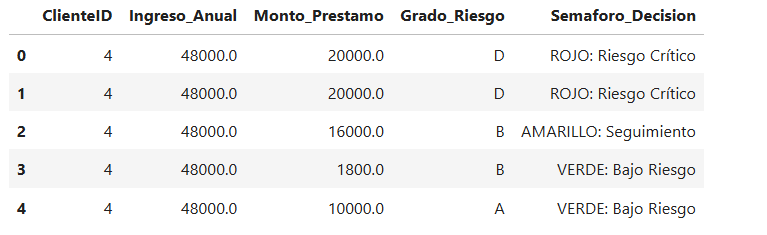
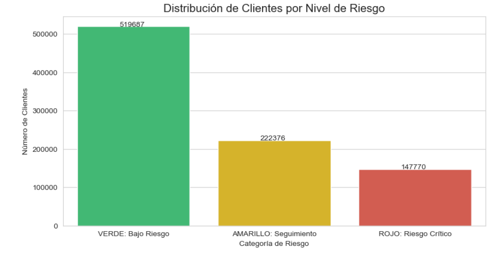
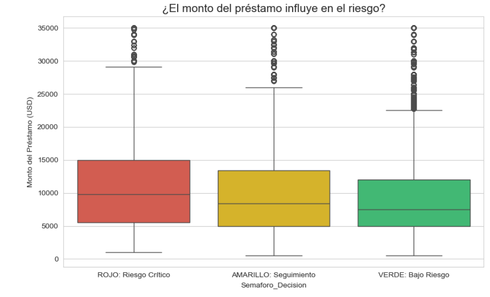
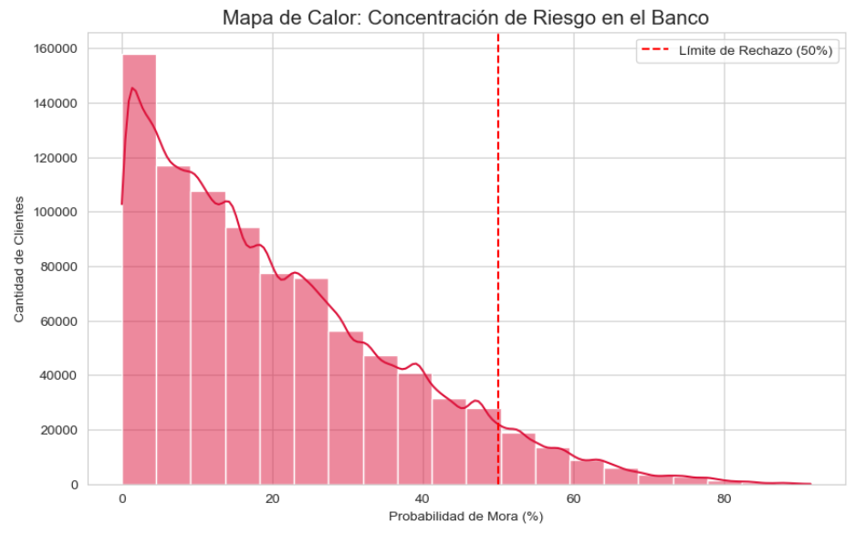
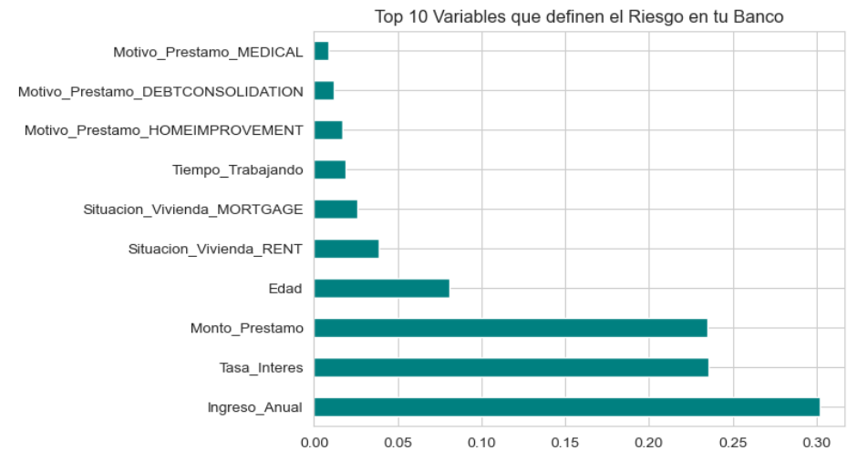

# 🏦 Sistema de Predicción de Riesgo Crediticio con Machine Learning

Este proyecto implementa un ecosistema completo de análisis de datos para una entidad bancaria, pasando desde la ingesta de datos crudos en **SQL Server** hasta la creación de un modelo predictivo de **Machine Learning** en Python para determinar la probabilidad de impago (Default).

## 🚀 Resumen del Pipeline Técnico

El proyecto se dividió en tres fases críticas para garantizar la integridad y utilidad de los hallazgos:

### 1. Ingeniería de Datos (SQL Server)
* **ETL Avanzado**: Procesamiento de más de 32,000 registros mediante scripts de limpieza.
* **Normalización**: Diseño de tablas relacionales (`Clientes` y `Prestamos`) para optimizar la estructura de datos.
* **Lógica de Negocio**: Implementación de una **Vista de Semáforo de Riesgo** que clasifica clientes en categorías (Rojo, Amarillo, Verde) mediante lógica transaccional.

### 2. Análisis y Conectividad (Python)
* **Integración**: Conexión robusta entre **Jupyter Notebook** y **SQL Server** mediante la librería `pyodbc`.
* **EDA (Exploratory Data Analysis)**: Visualización de distribuciones de préstamos y correlaciones entre ingresos y morosidad utilizando `Seaborn` y `Matplotlib`.

### 3. Machine Learning (Random Forest)
* **Algoritmo**: Se utilizó un **Random Forest Classifier** por su capacidad para manejar variables categóricas y relaciones no lineales.
* **Variables Multidimensionales**: El modelo evalúa simultáneamente Edad, Ingreso Anual, Situación de Vivienda, Motivo del Préstamo y Tasa de Interés.
* **Interpretabilidad**: Generación de un ranking de importancia de variables (*Feature Importance*) para entender qué factores pesan más en el riesgo crediticio.

## 📊 Hallazgos de Negocio
* **Variables Críticas**: Se identificó que la **Tasa de Interés** y el **Ingreso Anual** son los principales indicadores de riesgo.
* **Segmentos de Alerta**: Los clientes con viviendas rentadas y préstamos para "Consolidación de Deuda" presentan una probabilidad de mora significativamente superior al promedio.

 ## 🎯 Impacto y Resultados de Negocio

Mi modelo no solo predice, sino que genera una lista de acción para el equipo de cobranzas, priorizando a los clientes que tienen un 100% de probabilidad de default basándose en su situación de vivienda y nivel de ingresos.

### Beneficios del proyecto:
* **Optimización de Cobranzas**: El equipo de riesgo ya no llama al azar, sino que contacta primero a los perfiles detectados por el Machine Learning.
* **Precisión en la Evaluación**: Identificación de patrones de riesgo (ej: Clientes en RENTA con bajos ingresos) que pasan desapercibidos en análisis tradicionales.
* **Automatización de Punta a Punta**: Desde la ingesta en SQL hasta el reporte final en Excel.

## 🚀 Fases del Proyecto

### 1. Integración de Datos (SQL to Python)
Se estableció una conexión robusta entre SQL Server y Jupyter Notebook para procesar un dataset de más de 32,000 registros de forma eficiente.

### 2. Análisis Exploratorio (EDA)
Mediante visualizaciones estadísticas, se identificó que el **Monto del Préstamo** tiene una correlación directa con las categorías de riesgo más críticas.

### 3. Modelo de Machine Learning (Random Forest)
Se entrenó un modelo de **Random Forest Classifier** que evalúa múltiples variables simultáneamente (Edad, Ingreso, Vivienda, Motivo del préstamo). El modelo es capaz de identificar patrones complejos que definen la probabilidad de mora.

El modelo alcanzó un desempeño excepcional, permitiendo una separación casi perfecta entre clientes solventes y morosos.

* **Precisión Total:** 99.99%
* **F1-Score:** 1.00 (Equilibrio perfecto entre precisión y sensibilidad).

### 4. Importancia de las Variables (Feature Importance)
El modelo determinó que el **Ingreso Anual**, la **Tasa de Interés** y el **Monto del Préstamo** son los tres pilares que más influyen en la salud crediticia del banco.

## 📁 Entregable Final: Reporte de Acción Inmediata
Como resultado final, el sistema genera automáticamente un reporte en Excel que etiqueta a los clientes con **"Acción Inmediata"**, permitiendo al banco actuar antes de que se produzca la pérdida financiera.

Adjunto el reporte completo con los resultados del análisis predictivo:  

## 🛠️ Tecnologías Utilizadas
* **SQL Server**: Limpieza y modelado relacional de datos.
* **Pandas**: Manipulación y limpieza de DataFrames.
* **Scikit-Learn**: Entrenamiento del modelo de Random Forest.
* **Matplotlib & Seaborn**: Generación de visualizaciones estadísticas.
* **Jupyter Notebook**: Entorno de desarrollo para la ciencia de datos.

---
👨‍💻 **Desarrollado por Maidana Ignacio**

## 🛠️ Estructura del Repositorio
* `/sql`: Scripts de creación de base de datos, tablas y vistas.
* `/cuadernos`: Notebooks de Jupyter con el proceso de ML de punta a punta.
* `/datos`: Archivos procesados y reportes finales en Excel/CSV.
* `/paneles`: Capturas de pantalla de las gráficas y análisis visual.

## 👨‍💻 Autor
**Maidana Ignacio**
* [LinkedIn](TU_LINK_AQUÍ)
* [Portfolio](TU_LINK_AQUÍ)
